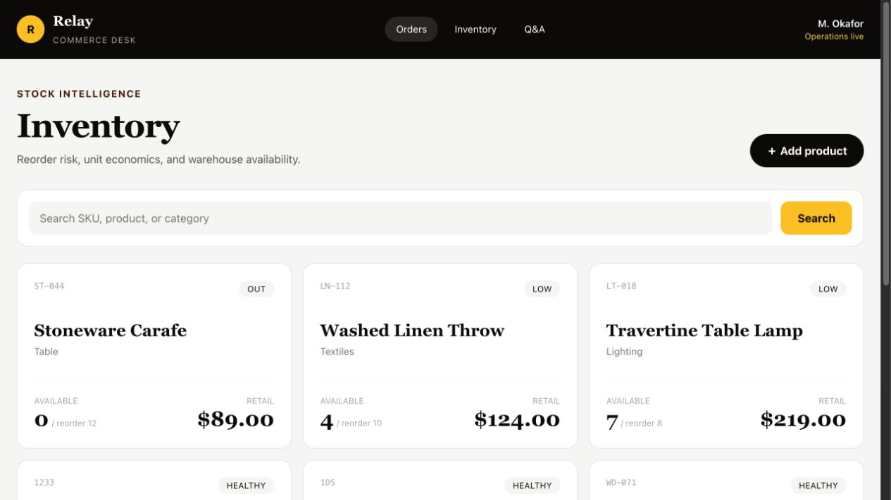
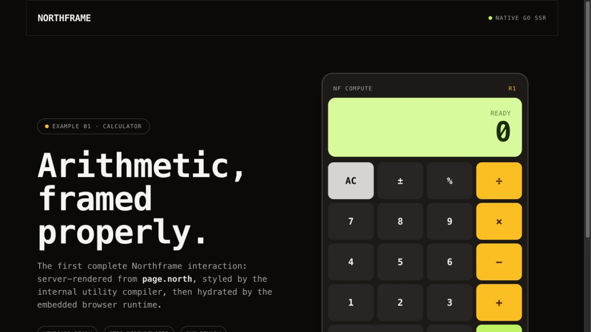

<p align="center">
  
</p>

<h1 align="center">Northframe</h1>

<p align="center">
  Native Go SSR with typed <code>.north</code> views and one-binary deployment.
</p>

Northframe is an experimental Laravel/Django-style framework for native Go SSR. It compiles structured `.north` views into a small generated Go layer, generates routes from the filesystem, embeds its browser runtime and CSS, and deploys as one executable.

The first public beta is `v0.1.0-beta`. It is suitable for evaluation, prototypes, and migration testing, but its APIs may still change before `v1.0.0`. Read the [beta compatibility contract](COMPATIBILITY.md) before choosing it for production.

Applications do not need Node, Deno, npm, `package.json`, Svelte, or a JavaScript server runtime.

## Built with Northframe

These applications are rendered by Go, styled by Northframe's built-in utility compiler, and enhanced with browser TypeScript only where interaction needs it.

<p align="center">
  
  
</p>

<p align="center"><sub>Relay Commerce · typed PostgreSQL inventory &nbsp;&nbsp;|&nbsp;&nbsp; Calculator · client interaction with native Go SSR</sub></p>

## Requirements

- Go 1.27 or newer

## Install the command

```sh
go install github.com/JohnKinyanjui/northframe/cmd/cli@v0.1.0-beta
north help
```

Go installs `north` into `GOBIN`, or into `$(go env GOPATH)/bin` when `GOBIN` is empty. Add that directory to your `PATH` if the command is not found. Contributors working from a Northframe checkout can instead run `go install ./cmd/cli`.

The CLI provides the application workflow:

```sh
north run
north create .
north generate
north build -o ./app
north db generate
north db create add_store_members
north db migrate
north db rollback
north db seed
north add date-fns
north remove date-fns
north update
north upgrade
north lsp
```

`north run` loads `.env`, compiles the application, and watches `.go`, `.north`, `.css`, `.env`, and public assets. Values already exported by the shell take precedence over `.env`.

The development command owns a stable public listener for the entire session. Each successful rebuild starts the new application on a private loopback port, waits until it accepts connections, atomically switches the public listener, and only then shuts down the previous child. The browser reload WebSocket belongs to the stable supervisor, so port 8000 never disappears during a rebuild. A failed compile leaves the last good application running, and Ctrl+C gracefully stops both the current child and the supervisor.

`north create .` safely scaffolds the current directory. It preserves unrelated directories, performs a complete conflict preflight before writing, and refuses to overwrite an existing application file.

After installing a newer `north` command, run `north upgrade --check` to preview the generated-file changes, then `north upgrade` to apply them. Upgrade compiles first, touches only `.generated/routes`, validates the Go application, and restores the previous generated files if validation fails. Route files, components, services, database files, and dependency versions are not rewritten.

See [Upgrading a Northframe application](docs/upgrading.md) for the upgrade boundary and its separation from JavaScript dependency updates.

## Application structure

```text
main.go                           # handwritten application entrypoint
app/                              # optional handwritten application code
web/                              # browser and HTTP presentation boundary
├── routes/
│   ├── layout.north             # required root document layout markup
│   ├── layout.north.go          # typed root layout loader and middleware
│   ├── layout.css               # optional colocated CSS
│   ├── page.north               # / markup
│   ├── page.north.go            # typed / loader and actions
│   ├── page.css                 # optional colocated CSS
│   ├── api/                     # optional JSON API routes
│   │   └── products/
│   │       └── route.go         # GET, POST, PUT, PATCH, DELETE...
│   └── auth/
│       ├── layout.north         # optional nested layout
│       ├── layout.north.go      # typed nested layout loader
│       ├── page.north           # /auth
│       ├── page.north.go        # typed /auth loader and actions
│       └── page.css
├── components/                  # independent typed .north components
├── client/                      # shared browser-only TypeScript modules
└── public/                      # assets embedded into the deployment binary
northframe.toml                   # client source and dependency declarations
northframe.lock                   # exact dependency graph and integrity hashes
.generated/routes/               # protected generated tree; never edit or commit
├── root/props_generated.go       # root PageProps/LayoutProps
└── auth/props_generated.go       # mirrors web/routes/auth
```

Every `page.north` requires a sibling `page.north.go`; every `layout.north` requires `layout.north.go`. Route CSS must be named `page.css` or `layout.css`.

`.nf` is intentionally rejected with migration guidance. The extension is now `.north`; it avoids the existing `.nf` ecosystem collision and remains immediately recognizable in a route tree.

## Language server

`north lsp` runs the built-in Language Server Protocol implementation over stdio. A dependency-free VS Code extension is included in `lsp/vscode`; it registers `.north`, starts `north lsp`, and adds syntax highlighting, snippets, restart controls, and server-path configuration.

The server shares the production compiler parser and currently provides:

- live syntax and layout diagnostics
- completion for typed props, imported Go types, component tags, component attributes, and template directives
- hover, go-to-definition, references, and rename support across props, loop values, and components
- embedded HTML, TypeScript, Emmet, and Tailwind intelligence
- safe whole-document formatting for HTML, TypeScript, Go-shaped control blocks, and `Props` contracts
- save-time Go import resolution and sorting inside `---` frontmatter

Northframe applications still require no Node process, editor-local parser, or `package.json`. VS Code itself requires a `package.json` manifest inside the extension directory, but that tooling file never enters an application. The colocated `.north.go` file continues to use the normal Go language server.

On save, the extension can resolve a missing qualifier such as `uuid.UUID` from the standard library, the current module, or dependencies already present in `go.mod`. It never runs `go get` or silently changes application dependencies. Add a new dependency explicitly first, then save the `.north` file to organize its import.

## What is generated

Northframe does not generate the application. Handlers, services, models, middleware, validation, database code, and business rules remain handwritten Go.

The ignored `.generated/routes` directory contains only:

- native Go render functions compiled from `.north`
- native component prop types, slot fragments, and render functions
- the filesystem route manifest
- layout composition
- generated TypeScript contracts for route and component props
- compiled utility CSS, browser modules, and embedded asset references

Every generated source begins with `// Code generated by Northframe. DO NOT EDIT.` and is recreated automatically by `north run`, `north generate`, and `north build`.

Generated props mirror the handwritten route tree under `.generated/routes`. Handwritten loaders import their protected route contract, while the generated router imports both; this keeps generated code out of application packages without creating an import cycle.

## Generated route props and typed sidecars

For simple rendered values, Northframe infers a string prop directly from the template:

```html
<h1>${Props.Title}</h1>
```

The loader uses the generated type without declaring a struct:

```go
import generated "example.test/app/.generated/routes/customers"

func Page(*web.Context) (generated.PageProps, error) {
    return generated.PageProps{Title: "Customers"}, nil
}
```

Collections, nested models, non-string values, and client-only props need an explicit template contract because their Go type cannot be guessed safely:

```html
<!-- web/routes/users/page.north -->
---
import db "example.test/app/internal/db/generated"

interface Props {
  Users []db.User
}
---

<ul>
  {for user := range Props.Users}
    <li>${user.Name}</li>
  {/for}
</ul>
```

The `.north.go` sidecar remains the source of truth for loading data and can call services, sqlc queries, validation helpers, or any normal Go function:

```go
// web/routes/users/page.north.go
package users

import (
    db "example.test/app/internal/db/generated"
    "github.com/JohnKinyanjui/northframe/pkg/web"
)

func Page(ctx *web.Context) (PageProps, error) {
    queries := web.MustUse[*db.Queries](ctx)
    users, err := queries.ListUsers(ctx.StdContext())
    return PageProps{Users: users}, err
}
```

Infrastructure is provided once in `main.go`:

```go
app := web.New()
web.Provide(app, db)
web.Provide(app, queries)
routes.Register(app)
http.ListenAndServe(":8080", app)
```

Northframe emits `PageProps` into the matching `.generated/routes/<route>/props_generated.go`, and the renderer and loader compile against that same type. A renamed, missing, or incompatible field fails at `go build`. `${Props.Name}` is an HTML-escaped Go value. `{if Props.Condition}` and `{for item := range Props.Items}` become native Go control flow and accept Go expressions. Generated renderers are formatted with `gofmt`. Existing handwritten props structs remain supported during migration, but a route must use either the template contract or the handwritten struct—not both.

Already-sanitized rich text uses `{html Props.ContentHTML}` and requires the concrete `web.SafeHTML` type. Northframe does not accept an ordinary string at this boundary: sanitize with an application allow-list first, then call `web.SafeHTMLFromSanitized(cleanHTML)`. This keeps normal interpolation escaped while supporting trusted CMS and editor output.

## Authentication, sessions, and permissions

`pkg/auth` provides optional opaque server-side sessions without imposing a
user table or database engine. Applications implement `auth.Store` with their
database or cache; `auth.NewMemoryStore` is available for development and tests:

```go
sessions, err := auth.New(auth.Config{
    Store:      postgresSessionStore,
    CookieName: "topduka_session",
    Lifetime:   24 * time.Hour,
    Secure:     true,
})

app.Use(auth.Load(sessions))
app.Handle("GET /dashboard", dashboard,
    auth.Require(sessions, auth.GuardOptions{
        LoginPath:   "/login",
        Permissions: []string{"dashboard.read"},
    }),
)
```

After verifying credentials, call `sessions.Start`. The browser receives a
32-byte random HttpOnly opaque token while the store only receives its SHA-256
digest. Sessions support expiry, revocation, application values, exact
permissions, global `*`, and namespace grants such as `orders.*`. Loaders and
actions access the resolved identity with `auth.Current(ctx)` or
`auth.MustCurrent(ctx)`. Password policy, user records, OAuth providers, and
multi-factor challenges remain application services instead of framework-owned
database models.

`pkg/admin` provides the typed resource registry for internal administration.
A resource declares its fields, labels, icon, CRUD permission names, and a
repository backed by application services or sqlc. `VisibleResources` filters
navigation through the current authenticated session. The registry validates
duplicate resources and fields and supplies predictable permissions such as
`admin.orders.view`. `admin.Mount` adds the responsive framework-owned dashboard,
search, pagination, create, edit, and delete routes without moving SQL into
handlers:

```go
registry := admin.NewRegistry()
registry.MustRegister(admin.Resource{
    Name: "products",
    Repository: productAdminRepository,
    Fields: []admin.Field{
        {Name: "id", ReadOnly: true},
        {Name: "name", Required: true, Searchable: true},
        {Name: "status", Kind: admin.FieldSelect, Options: statusOptions},
    },
    Validate: validateProductAdminForm,
})
admin.Mount(app, registry, sessions, admin.Options{BasePath: "/admin"})
```

Existing applications do not have to replace their authentication system.
`admin.MountWithAccess` accepts application middleware plus a resolver that maps
the authenticated account into `auth.Session`. The resolved session is also
available to repositories through `auth.SessionFromContext`, so tenant and user
scope stay explicit at the service boundary. Admin forms include CSRF protection,
reject invalid select values, and merge resource validation into field errors.

## Request context and application services

Loaders and actions receive `*web.Context`, not a bare `*http.Request`. The context provides:

- `ctx.Request` for full standard-library access
- `ctx.DB` when a `*sql.DB` was registered with `web.Provide`
- `ctx.Param`, `ctx.Query`, `ctx.Form`, `ctx.FormValue`, and `ctx.Cookie`
- `ctx.StdContext()` for database calls and `ctx.DetachedContext()` for queued or scheduled work
- request-scoped `ctx.Locals`, populated from middleware with `web.SetLocal`
- `web.Use[T](ctx)` and `web.MustUse[T](ctx)` for sqlc query sets, services, mailers, queues, caches, and schedulers
- action-only response helpers including `ctx.Redirect`, `ctx.JSON`, `ctx.NoContent`, and `ctx.SetCookie`

The context does not hard-code one scheduler, queue, or ORM. Applications register the concrete service they chose once, and sidecars resolve it with its real Go type.

## Layouts

The root `web/routes/layout.north` owns the HTML document and must contain `<head>`, `<body>`, and `<slot />`. Northframe generates `LayoutProps`; its sidecar implements `Layout(*web.Context) (LayoutProps, error)`. Subdirectories can add another layout; Northframe wraps the page from its nearest layout outward using native Go fragments.

## Dynamic routes, actions, middleware, and errors

Go-safe parameter folder names compile to standard `net/http` patterns:

```text
web/routes/users/id_/page.north       /users/{id}
web/routes/files/path__/page.north    /files/{path...}
```

Read parameters with `ctx.Param("id")` inside `page.north.go`.

Sidecars can expose a default page action, a relative action, or an absolute application path:

```go
func PageActions() []web.Action {
    return []web.Action{
        web.Post("", saveCurrentPage),
        web.Post("invite", inviteUser),
        web.Post("/signup", signup),
    }
}

func signup(ctx *web.Context) error {
    email := ctx.FormValue("email")
    // validate and call a service or ctx.DB here
    return ctx.Redirect("/account", 303)
}
```

For application forms, prefer a typed action. Northframe decodes the request at
the HTTP boundary and returns field-addressable validation results to enhanced
forms while keeping the same endpoint usable without JavaScript:

```go
type SignupInput struct {
    Email string `form:"email" validate:"required,email"`
    Age   int    `form:"age" validate:"required,min=18"`
}

func PageActions() []web.Action {
    return []web.Action{web.PostForm("/signup", signup)}
}

func signup(ctx *web.Context, input SignupInput) (web.ActionResult, error) {
    if emailAlreadyExists(input.Email) {
        return web.ActionInvalid("Please correct the highlighted field.", web.FieldErrors{
            "email": "An account already uses this email address",
        }), nil
    }
    return web.ActionRedirect("/account", http.StatusSeeOther), nil
}
```

`form` selects the HTML field name, `label` customizes generated messages, and
`validate` supports `required`, `email`, `min`, and `max`. Strings use character
length for min/max; numeric fields use numeric bounds. Custom scalar types can
implement `encoding.TextUnmarshaler`.

Plain HTML routing is the contract: `<form method="post" action="/signup">` works without JavaScript. A button can use the standard `formaction` attribute to select a different path.

`PageMiddleware()` and `LayoutMiddleware()` return `[]web.Middleware`. Layout middleware is inherited by all descendant pages and actions. `web.CSRF()` provides double-submit protection and the embedded browser runtime automatically adds the hidden token to unsafe forms.

Loaders can return `web.NotFound`, `web.BadRequest`, or `web.Error` for controlled
status responses. Rendering happens in a buffer, so a loader or renderer failure
cannot send half a document. Applications can install a native custom error page
without losing safe public messages, status codes, request IDs, or redirects:

```go
app.SetErrorRenderer(func(writer io.Writer, page web.ErrorPage) error {
    return components.RenderErrorPage(writer, components.ErrorPageProps{
        Status: page.Status,
        Message: page.Message,
        Path: page.Path,
    })
})
```

The renderer can be a generated independent `.north` component. Internal error
causes are logged server-side; production pages should only display the safe
fields from `web.ErrorPage`.

## API routes

The optional `web/routes/api` directory defines JSON endpoints without templates or
manual router registration. Keep each endpoint in one `route.go` by default:

```text
web/routes/
  api/
    products/
      route.go
    users/
      id_/
        route.go
```

An exported HTTP method function becomes an endpoint at the folder URL:

```go
package products

func GET(ctx *web.Context) error {
    products, err := catalogue.List(ctx.StdContext(), ctx.Query("q"))
    if err != nil {
        return web.Error(http.StatusInternalServerError, "unable to list products", err)
    }
    return ctx.JSON(http.StatusOK, map[string]any{"products": products})
}
```

Northframe discovers `GET`, `POST`, `PUT`, `PATCH`, `DELETE`, `OPTIONS`, and
`HEAD`, all with the signature `func METHOD(*web.Context) error`. `web/routes/api`
maps to `/api`; `web/routes/api/products` maps to `/api/products`; `id_` and `path__` retain the
same dynamic and catch-all conventions as page routes. A folder can optionally
export `Middleware() []web.Middleware`.

Northframe discovers method functions across every `.go` file in the endpoint
folder, so large endpoints may still be split later. `get.go` and `post.go` are
an organizational option, never a requirement.

Use `ctx.DecodeJSON(&input)` for strict request decoding. It rejects unknown
fields and limits request bodies to 1 MiB. Controlled errors are returned as a
safe JSON envelope, while internal error details remain server-only.

## WebSockets

WebSockets run on the same Northframe server and through the same middleware
chain as pages and API routes. No proxy or second process is required:

For convention-based endpoints, place the handler in the normal API tree:

```go
// web/routes/api/notifications/route.go
package notifications

import (
    "time"

    "github.com/JohnKinyanjui/northframe/pkg/web"
)

func WebSocketOptions() web.SocketOptions {
    return web.SocketOptions{
        ReadLimit:      64 << 10,
        ReadTimeout:    75 * time.Second,
        WriteTimeout:   5 * time.Second,
        MaxConnections: 1_000,
    }
}

func WEBSOCKET(ctx *web.Context, socket *web.Socket) error {
    for {
        var message ClientMessage
        if err := socket.ReadJSON(ctx.StdContext(), &message); err != nil {
            return err
        }
        if err := socket.WriteJSON(ctx.StdContext(), handle(message)); err != nil {
            return err
        }
    }
}
```

This registers `/api/notifications`. `Middleware() []web.Middleware` in the
same folder protects both HTTP and WebSocket handlers. A folder cannot expose
both `GET` and `WEBSOCKET`, because both own the same HTTP upgrade path; put one
of them in a child folder instead. `WebSocketOptions` is optional and defaults
to same-origin verification with compression disabled.

The client remains ordinary type-safe TypeScript—WebAssembly is not required:

```html
<script lang="ts">
type InventoryRequest = { search: string };
type InventoryResponse = { products: Array<{ sku: string; name: string }> };

const protocol = location.protocol === "https:" ? "wss:" : "ws:";
const socket = new WebSocket(`${protocol}//${location.host}/api/products/live`);

function send(message: InventoryRequest): void {
    socket.send(JSON.stringify(message));
}

socket.addEventListener("message", (event) => {
    const response = JSON.parse(String(event.data)) as InventoryResponse;
    console.log(response.products);
});
</script>
```

The commerce example includes this exact PostgreSQL-backed endpoint at
`web/routes/api/products/live/route.go`.

For programmatic registration outside the route tree:

```go
app.WebSocket("/ws/notifications", web.SocketOptions{
    OriginPatterns:   []string{"admin.example.com"}, // omit for same-origin only
    ReadLimit:        64 << 10,
    ReadTimeout:      75 * time.Second,
    WriteTimeout:     5 * time.Second,
    MaxConnections:   1_000,
    Compression:      web.SocketCompressionNoContextTakeover,
}, func(ctx *web.Context, socket *web.Socket) error {
    notifications := web.MustUse[*NotificationService](ctx)
    for {
        var message ClientMessage
        if err := socket.ReadJSON(socket.Context(), &message); err != nil {
            return err
        }
        response, err := notifications.Handle(socket.Context(), message)
        if err != nil {
            return err
        }
        if err := socket.WriteJSON(socket.Context(), response); err != nil {
            return err
        }
    }
}, requireSession)
```

Same-origin verification is enabled by default. `OriginPatterns` explicitly
allows trusted cross-origin browser clients. `InsecureSkipOriginVerification`
is an intentionally loud escape hatch for controlled non-browser development
clients and must not be enabled in production.
Route middleware runs before the upgrade, making it the right place to reject
unauthenticated connections with a normal HTTP response.

`Socket` provides context-aware text, binary, JSON, ping, subprotocol, and close
operations. `ReadLimit`, endpoint connection limits, read/write timeouts, panic
containment, and optional compression are enforced by the framework. During
server shutdown, call `app.ShutdownWebSockets(ctx)` before `http.Server.Shutdown`
to send active clients status 1001 and then force-close them if the deadline
expires.

## Progressive forms and loading UI

Add `nf-enhance` when a POST form should use the embedded browser runtime. Without JavaScript it remains a normal HTML form; with JavaScript, Northframe submits it with `fetch`, follows redirects, preserves CSRF protection, disables submit controls, sets `aria-busy`, and exposes loading/idle content.

```html
<form method="post" action="/signup" nf-enhance>
  <input name="email" type="email" required>
  <button>
    <span nf-idle>Create account</span>
    <span nf-loading hidden>Creating…</span>
  </button>
</form>
```

Forms dispatch `northframe:submit`, `northframe:success`, `northframe:invalid`, `northframe:error`, and `northframe:complete` DOM events for application-specific behavior.

Typed inputs may include `*multipart.FileHeader` or
`[]*multipart.FileHeader`. The same `required` validation works for files;
`maxbytes` enforces size and the separate `accept` tag checks media types from
the file contents instead of trusting the browser header:

```go
type ProductInput struct {
    Name  string                `form:"name" validate:"required,min=3"`
    Image *multipart.FileHeader `form:"image" validate:"required,maxbytes=5242880" accept:"image/*"`
}
```

`web.SaveUploadedFile` streams to an explicit application path through a
same-directory temporary file, enforces the limit again, syncs the complete
content, and atomically replaces the destination. `web.UploadedFilename`
returns only a safe display basename; applications should generate storage
keys rather than trusting client filenames.

Structured errors are rendered into `[nf-error="field_name"]`; `[nf-message]`
receives the action message. Matching controls receive `aria-invalid`, and the
first invalid field is focused. Template handlers can listen to the hyphenated
aliases such as `on:northframe-invalid={handleInvalid}` and use the generated
`NorthframeActionEvent<T>` TypeScript type.

## Compiled TypeScript state

Route-local browser state lives in a Svelte-like TypeScript block. Northframe checks declarations, assignments, PageProps access, bindings, and event handlers in its supported TypeScript subset, then bundles it with esbuild's Go API and embeds the resulting JavaScript module in the Go application—there is still no Node process, `package.json`, or frontend installation.

```html
<script lang="ts">
let open: boolean = false;
let name: string = "";

function toggle(): void {
  open = !open;
}
</script>

<button type="button" on:click={toggle} aria-expanded=#{open}>Menu</button>
<nav show=#{open}>Hello #{name}</nav>
<input bind:value=#{name}>
```

The namespaces are deliberate: `${Props.Name}` reads typed Go SSR data, while `#{name}` reads TypeScript browser state. The reserved TypeScript `props` value follows the generated `PageProps` or `LayoutProps` contract, is serialized as safe inert JSON during SSR, and is typed in `northframe_contracts_generated.ts`. `on:event={handler}` rerenders after synchronous and asynchronous handlers. `show=#{state}`, `bind:value=#{state}`, `class:name=#{state}`, reactive ARIA/data attributes, and text bindings are compiled rather than interpreted at runtime.

### JavaScript dependencies without package.json

Use normal TypeScript imports after adding a browser package through Northframe:

```sh
north add date-fns
north add chart.js@4.5.0
```

```html
<script lang="ts">
import { format } from "date-fns";
import { calculateTax } from "$client/tax";

let today: string = format(new Date(), "PP");
</script>
```

`northframe.toml` records direct dependencies and the shared client source directory. `northframe.lock` records the exact direct and transitive versions, tarball locations, and integrity hashes. Both files should be committed. Downloaded package contents live under ignored `.northframe/`; `north update` reconstructs them on another machine.

This is intentionally narrower than `package.json`: Go dependencies and the application identity stay in `go.mod`; `northframe.toml` contains only Northframe compiler settings and browser dependencies. It has no Node scripts, lifecycle hooks, package-manager metadata, or Node runtime contract. See [northframe.toml versus package.json](docs/project-manifest.md).

Northframe downloads package metadata and tarballs directly, verifies their published integrity, and never runs package lifecycle scripts. esbuild recursively bundles browser-compatible ESM and CommonJS into the generated Go assets. Relative imports resolve beside the `.north` file, `$client/...` resolves from the configured client directory, and explicit `https://` imports remain browser imports. Node built-ins and native/install-script packages are rejected because the deployed application has no Node runtime. Package-imported CSS is not supported yet; keep styles in `page.css` or `layout.css`.

## Independent components and public assets

Components live below `web/components/`, declare Go props, and are invoked with PascalCase tags:

```html
<!-- web/components/panel.north -->
---
interface Props {
  Title string
}
---

<script lang="ts">
let open: boolean = false;
function toggle(): void { open = !open; }
</script>

<button on:click={toggle}>${Props.Title}</button>
<section show=#{open}><slot /></section>
```

Use it from a page, layout, or another component:

```html
<Panel Title=${Props.PageTitle}>
  <p>This child markup becomes the component slot.</p>
</Panel>
```

Northframe generates `PanelProps`, `RenderPanel`, and a TypeScript `PanelProps` contract. Go compilation checks prop values, child markup becomes a native `web.Fragment`, and every rendered instance gets an isolated browser-state scope. Missing or unknown props, unknown components, and child content passed to a component without `<slot />` are compiler errors. The earlier `{#include path}` syntax remains available for simple static source inclusion.

Components can emit typed browser events without turning callbacks into Go props. The child calls the built-in `dispatch` helper; the parent listens on the component invocation. Events bubble through an isolated `display: contents` boundary, so normal DOM event semantics and TypeScript `CustomEvent<T>` typing apply:

```html
<!-- web/components/dialog.north -->
<script lang="ts">
function finish(): void {
  dispatch("complete", { id: props.ID });
}
</script>
<button on:click={finish}>Done</button>
```

```html
<script lang="ts">
function completed(event: CustomEvent<{ id: string }>): void {
  console.log(event.detail.id);
}
</script>
<Dialog ID=${Props.ID} on:complete={completed} />
```

Everything below `web/public/` is embedded into the generated router and served from `/public/` with content types, immutable caching, and ETags. No files are required beside the production executable.

## Internal Tailwind-compatible utilities

Common Tailwind utility classes work directly in `.north` views without installing Tailwind:

```html
<main class="max-w-4xl mx-auto px-6 py-16">
  <h1 class="text-5xl font-extrabold text-white">Hello</h1>
</main>
```

Northframe scans views and emits only used utility rules. Colocated `page.css` and `layout.css` remain available for application-specific CSS. The resulting stylesheet is embedded and served at `/_northframe/app.css`.

## Fonts and typography

Northframe exposes four font variables and matching utilities:

```css
/* web/routes/layout.css */
:root {
  --nf-font-sans: "IBM Plex Sans", sans-serif;
  --nf-font-serif: "Source Serif 4", serif;
  --nf-font-mono: "IBM Plex Mono", monospace;
  --nf-font-display: "Fraunces", serif;
}
```

Use them directly in `.north` files:

```html
<body class="font-sans">
  <h1 class="font-display text-5xl">Operations</h1>
</body>
```

For a hosted font, place its stylesheet `<link>` in `web/routes/layout.north`. For a self-hosted font, put the files below `web/public/fonts/` and declare them in `web/routes/layout.css`:

```css
@font-face {
  font-family: "Atlas Sans";
  src: url("/public/fonts/atlas-sans.woff2") format("woff2");
  font-display: swap;
}
```

## Databases and sqlc

Northframe has opt-in driver packages, so an application only compiles the engine it imports:

```go
import (
    "github.com/JohnKinyanjui/northframe/pkg/database"
    "github.com/JohnKinyanjui/northframe/pkg/database/sqlite"
)

db, err := sqlite.Open("file:app.db?_pragma=foreign_keys(1)", database.Pool{
    MaxOpenConns: 8,
    MaxIdleConns: 4,
})
```

Equivalent packages are available at `database/postgres` and `database/mysql`. The shared package provides pool configuration, health checks, and ordered transactional migrations. Put `-- northframe:split` between statements in a migration.

sqlc supports `postgresql`, `mysql`, and `sqlite`. Each application keeps its own dialect-specific schema and query files, then generates typed Go code with:

```sh
north db generate
```

Applications place their migration runner in `cmd/migrator`. Northframe loads
the project's `.env` and exposes the runner through a consistent CLI:

```sh
north db verify
north db create add_store_members
north db migrate
north db rollback
north db seed
north db status
north db version
```

`north db create` writes the next zero-padded migration below
`internal/db/migrations` with Goose `Up` and `Down` sections. `north db migrate`
and `north db rollback` map to the application runner's `up` and `down`
operations. `north db seed` runs `cmd/seeder` and forwards options such as
`-only`. `north db adopt` is also available for applications that need to
baseline a known legacy schema.

Northframe treats `internal/db/generated` as read-only output. SQL belongs in `internal/db/query`, schemas or migrations belong in `internal/db/schema` or `internal/db/migrations`, and handlers/services consume the generated query API.

## Calculator example

The included calculator demonstrates SSR, a root layout, generated utilities, responsive design, browser hydration, mouse input, keyboard input, chained operations, decimals, percentages, sign changes, backspace, clearing, and division-by-zero handling.

```sh
cd examples/calculator
north run
```

Open <http://localhost:8000>.

Build one deployment executable:

```sh
cd examples/calculator
north build -o ./northframe-calculator
```

Before shipping an application, `north deploy check` regenerates its protected output and proves the production executable can be built. `north deploy docker -output Dockerfile` creates a non-root multi-stage container definition with an `/api/health` probe. Structured request logging and trace correlation, cache adapters, SMTP mail, retrying jobs, and recurring schedules are documented in [Production operations](docs/production.md).

## Commerce example

Commerce is the database-backed stress test. It exercises nested routes, independent typed components, isolated component state, Go-to-TypeScript contracts, PostgreSQL migrations and seed data, sqlc generation, SSR, searchable inventory, CSRF-protected actions, pending form UI, and a searchable Northframe comparison Q&A page.

```sh
cd examples/commerce
north db generate
north run
```

Commerce requires `DATABASE_URL`. The Add Product action validates in Go and writes through sqlc; the generated pages, client modules, utility CSS, migrations, and assets ship in the same Go executable. See `examples/commerce/QA.md` for the full regression checklist.

The repository intentionally keeps two focused examples: Commerce for the full framework path and Calculator for rich client state without a database.

## What is still missing

Northframe is now a useful framework prototype, but it is not production-complete. The main remaining systems are:

- credential-provider adapters such as OAuth/OIDC and WebAuthn (opaque sessions,
  permission guards, adaptable application authentication, and the framework-owned
  admin CRUD UI are available now)
- full TypeScript semantic checking beyond Northframe's supported state subset
- JavaScript-package CSS imports, Node built-ins, native addons, lifecycle scripts, and multi-version dependency graphs
- component package distribution (named slots, typed default props, and bubbling component events are available now)
- nested route-level error boundaries (a root `web/routes/error.north` convention
  already handles safe application errors and unknown GET routes)
- streaming responses and advanced response metadata
- a complete Tailwind-compatible utility surface, arbitrary values, and diagnostics
- Marketplace/Open VSX publishing for the included VS Code extension
- distributed adapters for Redis-compatible caches and durable external queues (the framework contracts, in-memory implementations, SMTP mail, structured logs/traces, schedules, and container deployment workflow are available now)
# northframe
